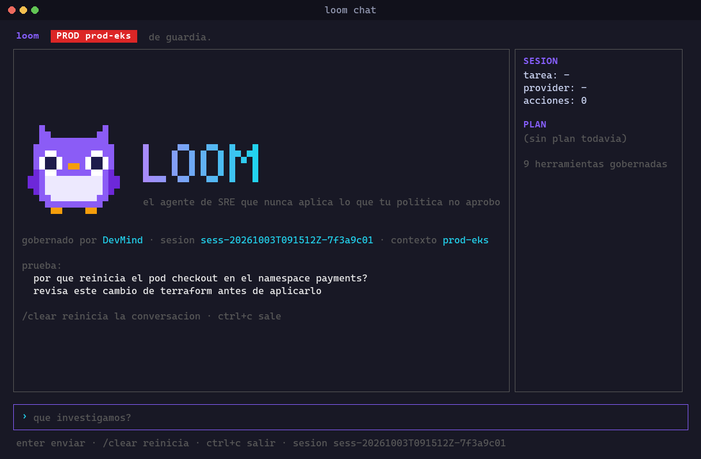
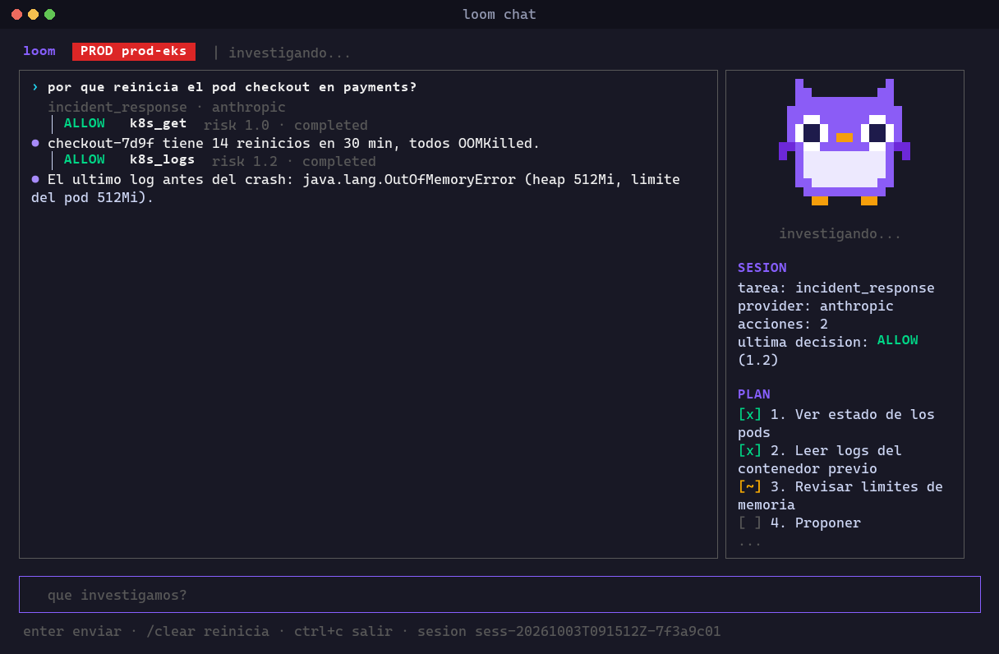
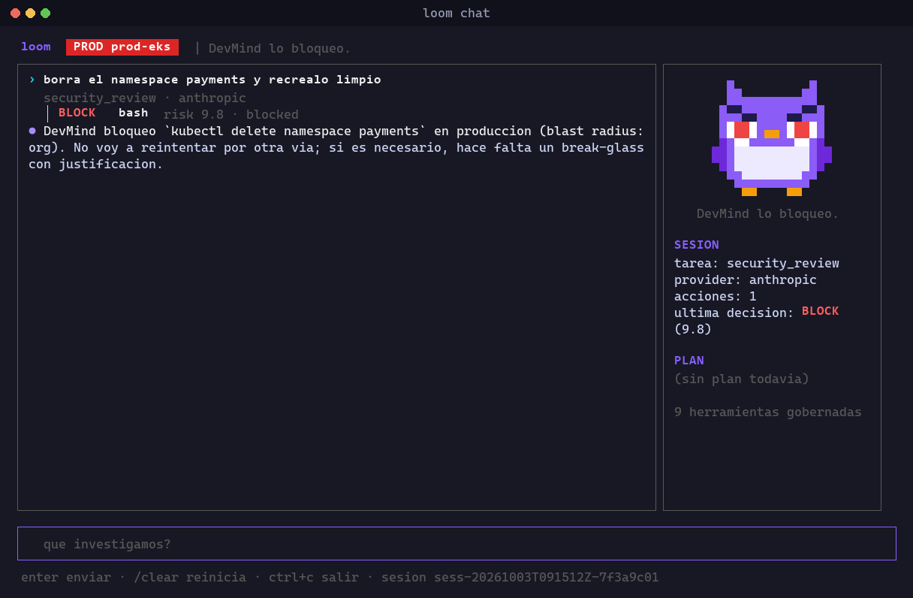
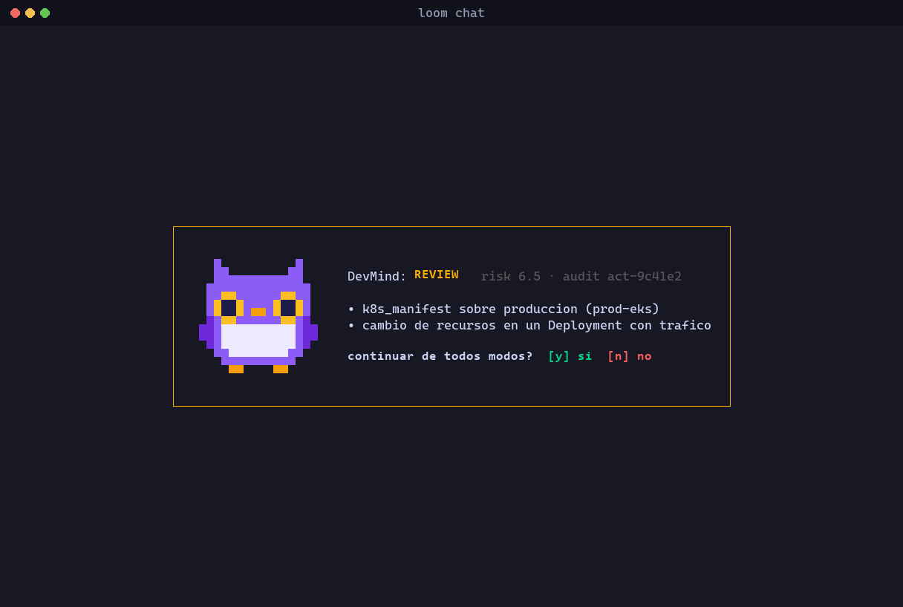

# Loom

[](https://github.com/mordecaiusm922-create/loom/actions/workflows/ci.yml)
[](LICENSE)

**The open-source SRE agent you can actually let take action — every change policy-gated.**



| Investigating an incident | DevMind blocks a destructive change |
|---|---|
|  |  |



Loom is a governed execution runtime for SRE / Platform Engineering agents.

It is not a general-purpose coding agent. Its domain is infrastructure and
platform operations: Terraform/OpenTofu, Kubernetes/Helm, cloud CLIs
(aws/gcloud/az), CI/CD, observability (Prometheus/Grafana/Datadog), incident
response, capacity, schema migrations, and access control (IAM, secret
rotation). The system prompt enforces this scope: asked for unrelated
application feature work, Loom says so and redirects instead of improvising
outside its domain.

The model thinks, Loom acts, and DevMind decides whether each tool action may
run. DevMind is a deterministic policy engine: the same action always gets
the same decision, and no LLM sits in the decision path. The model provider
is replaceable; the policy gate is not accidentally optional. Loom talks to
DevMind over its REST API today; that is an implementation detail, not a
contract — DevMind also exposes a remote MCP server, and moving Loom's
governance client onto it is planned (see Roadmap, Phase 3).

The shell underneath Loom is configurable with `sre.shell`. When unset, it
follows the host OS:

- `"bash"` (default on Linux and macOS) — commands run as
  `bash --noprofile --norc -o pipefail -c`, so dotfiles can't change
  behavior and a failure inside a pipeline is reported, not masked.
- `"powershell"` (default on Windows) — PowerShell 7+ (`pwsh`), also usable
  on Linux and macOS by setting it explicitly.

Only the configured shell is offered to the model (as a tool named
`powershell` or `bash`), so it never writes bash syntax into PowerShell or
the reverse. Both go through the same infra classification and governance.

## What works

- Per-request model routing to Anthropic, Ollama, or any configured
  OpenAI-compatible API. Use `--task` for a deterministic route in CI
  (`trivial_edit`, `planning`, `security_review`, `incident_response`).
- Native tool-call conversations for Anthropic, modern Ollama models, and
  OpenAI-compatible providers that declare `supports_tooling: true`.
- A DevMind decision before **every** built-in tool call — the generic
  shell escape hatch (`bash` or `powershell`), `read_file`, `write_file`, `update_plan`, and
  every native SRE tool below. No tool bypasses this, including the
  read-only ones.
- **Native, structured investigation tools** that call binaries directly via
  `exec.Command` with an argument list — no shell, no string interpolation,
  no injection surface — instead of asking the model to hand-build a
  `kubectl`/cloud-CLI invocation as free text every time:
  - `k8s_get`, `k8s_describe`, `k8s_logs` — read Kubernetes state, honoring
    `sre.kube_context` when set. `k8s_get` with `output: "json"` condenses
    pods/deployments/replicasets/statefulsets/daemonsets/nodes/services/
    events into a compact table (name, ready count, status, restarts, age,
    etc.) instead of the full manifest; pass `raw: true` to get the
    manifest back. Unrecognized kinds fall back to kubectl's own JSON
    unchanged.
  - `cloud_read` — read-only `aws`/`gcloud`/`az` calls. Rejects any argument
    that looks like a mutating verb (`create`, `delete`, `terminate-*`,
    `put-*`, …) inside the tool itself, in addition to (not instead of) the
    governance check every call still goes through. Output is passed
    through as-is: aws/gcloud/az response shapes vary too much per
    subcommand to normalize generically and safely.
  - `metrics_query` — queries Prometheus, Grafana, or Datadog using the
    endpoints configured under `sre.observability`. Instant (`vector`/
    `scalar`) results condense to a METRIC/VALUE (or METRIC/SCOPE/LATEST for
    Datadog) table; range/matrix results are returned in full on purpose —
    condensing a time series would throw away the trend. `raw: true` always
    returns the full API response.
  - The general-purpose shell tool (`bash` or `powershell`) remains for anything these don't
    cover, and for applying real changes.
- Infra-aware classification of shell commands into DevMind's real
  `ChangeType` enum before they're evaluated, so the blast-radius invariant
  actually fires instead of silently no-oping on a raw command string:
  - **Terraform/OpenTofu** (`plan`/`apply`/`destroy`) → `terraform_apply`
  - **Kubernetes** (`apply`/`delete`/`scale`/`rollout`/`drain`/`cordon`/`patch`/`edit`/`replace`) → `k8s_manifest`
  - **Helm** (`install`/`upgrade`/`uninstall`/`rollback`) → `helm_release`
  - **IAM** across aws/gcloud/az → `iam_change`
  - **Secret rotation** (Secrets Manager, Secret Manager, Key Vault, Vault) → `secret_rotation`
  - **Schema migrations** (Alembic, Rails, Flyway, Prisma, Django) → `schema_migration`
  - **Direct destructive cloud calls** outside Terraform/Helm (e.g. `terminate-instances`, `delete-db-instance`) → `config_change`
  - Read-only cloud/k8s calls and observability queries are left unclassified
    on purpose, so they route through the low-risk generic policy engine
    instead of the infra engine.
- **Argv-based change classification.** Commands are split on shell
  separators, tokenized honoring quotes, stripped of wrappers (`VAR=x`,
  `sudo`, `env`, `npx`, `bundle exec`, ...), and classified by the real
  binary and subcommand, so `terraform -chdir=infra apply`, `kubectl
  --context prod delete`, `kubectl.exe delete`, `& terraform apply` and
  `bash -c "..."` are all caught. Opaque execution (`iex`,
  `Invoke-Expression`, `eval`, `pwsh -EncodedCommand`) goes to the infra
  engine. `terraform plan` is `terraform_plan`, not an apply. The evasion
  suite in `internal/tools/classify_test.go` only grows.
- **Environment resolution.** Declare your environments under
  `sre.environments` (kube contexts, cloud profiles, Terraform workspaces,
  repo paths → `prod|staging|dev`). Every call is resolved against them,
  including the `sre.kube_context` the native `k8s_*` tools inject; a
  whole-word keyword heuristic is only the fallback. An infrastructure
  change whose target cannot be resolved is evaluated as production.
- **Secrets never reach the model.** `read_file`/`write_file` refuse
  credential files (`~/.aws/credentials`, kubeconfig, `.env*`, `*.pem`,
  `*.key`, `~/.ssh`, `*.tfstate`, ...), resolving `~`, relative paths and
  symlinks first. Every tool output is redacted (cloud keys, JWTs, tokens,
  URL credentials, `password=...`, Kubernetes Secret `data:`) and capped
  at `sre.max_tool_output_bytes` (default 30000, head and tail kept)
  before it is sent to the provider.
- `loom chat` keeps the conversation across turns; `/clear` resets it.
- Session IDs are `sess-<UTC timestamp>-<random>`, one `.jsonl` timeline per
  session (never appended to), and each record carries DevMind's
  `audit_id` so the local timeline joins DevMind's audit trail.
- Fail-closed governance: network errors, invalid HTTP responses, malformed
  responses, and unknown policy decisions become `REVIEW`, never `ALLOW`.
- Readable action traces containing the tool, decision, risk score, outcome,
  and session ID—never the action payload.
- **A persisted incident timeline.** Every `run` and `chat` session
  best-effort-appends its audit trail to `.loom/sessions/<session-id>.jsonl`
  (same no-payload redaction as the live trace), so a postmortem can
  reconstruct what Loom actually did after the terminal is long closed.
- **Runbooks.** `loom run --runbook <name> "<extra context>"` loads
  `runbooks/<name>.json` and seeds the model's starting prompt and task hint
  from it — a standard starting procedure the model still adapts to what it
  actually finds, not a blind script. `loom runbooks` lists what's
  available. Two examples ship in `runbooks/`: `pod-crashloop` and
  `high-latency`.
- **`--dry-run` rehearsal mode**, on both `loom run` and `loom chat`. A
  mutating tool call (the shell tool, `write_file`, or any MCP tool without an
  explicit `readOnlyHint` annotation) is skipped *before governance is even
  consulted* and reported back as `[dry-run] <tool> no se ejecuto`. Read-only
  tools (`k8s_get`, `cloud_read`, `metrics_query`, `read_file`) still run for
  real, so the model can actually investigate while rehearsing a runbook or
  a risky change. Any new mutating tool must declare `Tool.IsMutating`, or it
  is invisible to `--dry-run` — this exact gap (the flag was threaded through
  but silently never checked) was found and fixed during this audit; see the
  regression tests in `internal/tools/tools_test.go` prefixed `TestDryRun`.
- **MCP servers as first-class tools.** Configure a local stdio MCP server
  under `mcp_servers` in `loom.config.json` and its tools appear in the same
  list as the native ones — same governance evaluation before every call,
  same audit trail, no special-casing anywhere else in the agent loop. An
  MCP tool without a `readOnlyHint`/`destructiveHint` annotation is treated
  as mutating by default for `--dry-run` purposes: an unlabelled remote
  action is never trusted. A per-call timeout (15s by default) means a
  hung server fails that one call instead of hanging the session; a
  misconfigured or unreachable server degrades that one integration
  (reported via a startup warning) instead of blocking Loom from starting
  at all — the native tools always work regardless of MCP server health.
- **Session resume.** `loom run --resume <session-id> "<new context>"` reads
  that session's persisted `.jsonl` timeline and folds a compact summary
  (tool, decision, outcome per call — never the raw payload) into the new
  session's starting prompt, so an on-call handoff doesn't lose state.
- **Per-session cost/latency accounting.** Every `run` prints and persists a
  `session_summary` record (input/output tokens, estimated cost from each
  provider's configured `cost_input_per_mtok`/`cost_output_per_mtok`, wall
  time) at the end of the run.
- `init`, `doctor` (checks the configured shell, `kubectl`,
  `terraform`/`tofu`, counts available runbooks, and proves the DevMind
  token works with one live read-only probe), `config` (prints the
  effective config with the token redacted), `run`, `runbooks`, and a test
  suite for the safety invariants, including regression tests that lock the
  `ChangeType` mapping to DevMind's actual enum (inventing a value like
  `terraform_destroy` gets rejected with HTTP 400 by the live API).

## Install

```bash
go install github.com/mordecaiusm922-create/loom/cmd/loom@latest
loom init
loom doctor
loom chat
```

`go install` puts the binary in `$(go env GOPATH)/bin` (on Windows,
`%USERPROFILE%\go\bin`); make sure that directory is on your PATH.

## Connect to DevMind

Every tool call is evaluated by DevMind, so Loom needs a DevMind token.
DevMind is in early access and tokens are issued on request.

```bash
export DEVMIND_TOKEN=dvm_...
loom doctor
```

`loom doctor` sends one harmless read-only probe and tells you exactly what
is wrong if it fails: missing token, rejected token (HTTP 401), a token
bound to a different agent (HTTP 403; set `LOOM_AGENT_ID` to match), or
DevMind unreachable. The first check after the service has been idle can
take up to a minute.

`DEVMIND_TOKEN` takes precedence over `governance.token` in
`loom.config.json`. Prefer the environment variable so the token never sits
in a file; `loom.config.json` is already in `.gitignore`. Without a working
token, governance still fails closed: every action becomes `REVIEW`, never
`ALLOW`.

## Build from source

Requires Go 1.22 or newer, plus the shell selected in `sre.shell` on PATH:
`bash` (default on Linux/macOS) or PowerShell 7+ (`pwsh`, default on Windows). Native investigation tools additionally need `kubectl`
and/or `aws`/`gcloud`/`az` on PATH for the ones you actually use; `loom
doctor` reports what it finds.

```bash
go build -o loom ./cmd/loom
go test ./...
```

## Quick start

```bash
./loom init
export OPENAI_API_KEY=sk-...
export DEVMIND_TOKEN=dvm_...
./loom doctor
./loom run --task planning "diseña el plan de migracion del cluster EKS a 1.31"
./loom run --task security_review "revisa este cambio de Terraform antes de aplicarlo"
./loom run --task incident_response "el servicio checkout esta devolviendo 5xx, investiga y proponme una accion"
./loom runbooks
./loom run --runbook pod-crashloop "namespace checkout, pod checkout-7d9f reiniciando cada 2 min"
./loom run --dry-run --task security_review "aplica el cambio de terraform en infra/prod"
./loom run --resume sess-1234 "sigue subiendo el error rate, continua la investigacion"
```

## CI no interactivo

Usa `--non-interactive` para correr Loom como un check gateado en CI. En este
modo, `BLOCK` conserva su fallo normal y `REVIEW`/`ESCALATE` abortan sin leer
stdin: una revisión humana necesaria pero imposible de confirmar en CI nunca
se aprueba automáticamente. Todos esos casos terminan con exit code distinto
de cero. El ejemplo mínimo en `.github/workflows/loom-example.yml` revisa el
diff de Terraform de un pull request; configura `OPENAI_API_KEY` y
`DEVMIND_TOKEN` como secretos antes de activarlo. Loom lee `DEVMIND_TOKEN`
directamente del entorno, asi que el token nunca se escribe en un archivo.

To use MCP servers, add them to `loom.config.json`:

```json
"mcp_servers": [
  { "name": "k8s-mcp", "command": "npx", "args": ["-y", "@some/k8s-mcp-server"] }
]
```

The sample configuration includes OpenAI, Groq, and a local vLLM server. It
also retains the built-in Ollama provider for users that prefer `/api/chat`.

```bash
ollama serve
ollama pull qwen2.5-coder:7b
```

## Governance contract

`governance.enabled=true` and `governance.engine="devmind"` are the default
and required runtime configuration. `BLOCK` stops the action; `REVIEW` and
`ESCALATE` require the user to type `y` unless `loom run --non-interactive`
is set, in which case they fail closed; `REWRITE` is not executed.

For an intentionally unsafe local experiment only, set both a disabled
governance config and `LOOM_UNSAFE_DISABLE_GOVERNANCE=1`. Loom emits a warning
on every such session. This opt-out exists for development, not production.

## Configuration

`loom.config.json` is project-local. Start with `loom init` or copy
`loom.config.example.json`.

```json
{
  "default_provider": "openai",
  "providers": {
    "anthropic": { "model": "claude-sonnet-4-6" },
    "ollama": { "model": "qwen2.5-coder:7b", "base_url": "http://localhost:11434" }
  },
  "custom_providers": [
    {
      "id": "openai",
      "base_url": "https://api.openai.com/v1",
      "model": "gpt-4.1-mini",
      "api_key_env": "OPENAI_API_KEY",
      "supports_tooling": true,
      "cost_input_per_mtok": 0.4,
      "cost_output_per_mtok": 1.6
    }
  ],
  "routing": [
    { "task": "planning", "provider": "openai" },
    { "task": "security_review", "provider": "openai" },
    { "task": "incident_response", "provider": "openai" }
  ],
  "governance": {
    "enabled": true,
    "engine": "devmind",
    "base_url": "https://devmind-2cej.onrender.com"
  },
  "sre": {
    "shell": "bash",
    "kube_context": "prod-eks",
    "cloud": { "provider": "aws", "profile": "prod" },
    "observability": {
      "prometheus_url": "http://localhost:9090",
      "datadog_site": "datadoghq.com",
      "datadog_api_key_env": "DATADOG_API_KEY",
      "datadog_app_key_env": "DATADOG_APP_KEY"
    },
    "runbooks_dir": "runbooks",
    "max_tool_output_bytes": 30000,
    "environments": [
      { "name": "prod-us", "tier": "prod", "kube_contexts": ["prod-eks"], "cloud_profiles": ["prod"], "paths": ["infra/live"] },
      { "name": "staging", "tier": "staging", "kube_contexts": ["stg-eks"], "paths": ["infra/staging"] }
    ]
  }
}
```

Every field under `sre` is optional and independently defaultable:
`kube_context` empty means "whatever kubectl's current-context already is";
`cloud.profile` empty means the CLI's own default credentials; every
`observability` endpoint is only required if you actually call
`metrics_query` against it; `runbooks_dir` defaults to `./runbooks`.

Every entry in `custom_providers` uses the OpenAI Chat Completions protocol.
To use Groq, Together, Fireworks, Mistral, DeepSeek, OpenRouter, vLLM,
llama.cpp server, or LM Studio, set its `id`, `base_url`, `model`, and (when
required) `api_key_env`; route a task to that ID. There is no legacy
`providers.openai` field.

A reasonable split for an SRE team: route `trivial_edit` to a fast/cheap
model, `planning` and `incident_response` to a fast tool-capable model, and
`security_review` (which now covers Terraform/K8s/IAM/secret-rotation/
destructive-cloud commands) to your strongest available model.

## Task classification

`loom run` without `--task` classifies the prompt by keyword before routing:

1. **`incident_response`** — outage/down/degraded/SEV1/SEV2/on-call/PagerDuty language.
2. **`security_review`** — production, IAM, terraform/tofu, kubectl/helm, delete/drop/terminate/drain, secrets, migrations.
3. **`planning`** — plan/design/review/runbook/postmortem/capacity/SLO/SLA language.
4. **`trivial_edit`** — everything else.

Keyword classification is a heuristic starting point, not a substitute for
`--task` in CI, where the route must be reproducible.

## Roadmap

See [ROADMAP.md](ROADMAP.md) for the full, ticket-level breakdown (scope,
files touched, acceptance criteria, dependencies, sizing) of every phase
below. Summary:

Loom's build order is deliberately Loom-first: Loom is hardened as a tool on
its own merits — its local safety net holds by itself — while the deeper
DevMind integration (MCP transport, shared org policy, server-side audit)
lands in Phase 3. Defense in depth: neither layer assumes the other is
there to catch its mistakes.

### Phase 0 — Done
Governed execution core: DevMind REST integration, fail-closed policy
evaluation, `ChangeType` classification for Terraform/K8s/Helm/IAM/secrets/
migrations/direct cloud calls, per-task model routing, audit tracing,
`init`/`doctor`/`config`/`run`/`chat`.

### Phase 1 — Done (this round)
Loom re-scoped as an SRE/Platform Engineering tool that stands on its own:
- PowerShell (`pwsh`) as the underlying shell, replacing bash/cmd.exe.
- Native, structured, no-shell investigation tools: `k8s_get`,
  `k8s_describe`, `k8s_logs`, `cloud_read` (with a mutating-verb guard),
  `metrics_query`.
- First-class `sre` config block (`kube_context`, `cloud.profile`,
  `observability.*`, `runbooks_dir`).
- Persisted per-session incident timeline (`.loom/sessions/*.jsonl`).
- Reusable runbooks (`loom run --runbook`, `loom runbooks`), shipped with
  two starter examples.
- System prompt scoped to SRE/Platform work only; `update_plan` tool bug
  fixed (it was referenced but never registered).

### Phase 2 — Done
- MCP stdio servers are exposed to the agent loop as first-class governed
  tools (`mcp_servers` in config), hardened with a per-call timeout, a
  SIGKILL fallback on close, and per-server degradation (one bad server
  warns and is skipped, it doesn't block the others or the native tools).
- `--dry-run` on `run`/`chat`: a mutating call is skipped before governance
  is even consulted; read-only tools still run for real.
- `loom run --resume <session-id>` folds a compact summary of a prior
  session's `.jsonl` timeline into the new prompt.
- Per-session token/cost/latency accounting, printed and persisted.
- Structured output: `k8s_get -o json` condenses to a table for common
  resource kinds; `metrics_query` condenses instant Prometheus/Grafana/
  Datadog results the same way. `raw: true` always available as an escape
  hatch. See `ROADMAP.md` §2.4.

### Phase 3 — DevMind integration rework
- Replace the REST `governance.Engine` implementation with an MCP client
  against DevMind's MCP server (now live). `governance.Engine` is already an
  interface (`EvaluateAction`/`EvaluateChange`); this should be a new
  implementation behind it, not a rewrite of `tools.Registry` or the agent
  loop — that boundary is the whole reason the interface exists.
- Shared, org-level policy config, distributed independently of any single
  Loom project checkout.
- Server-side audit storage (today's `.loom/sessions/*.jsonl` is local-only
  by design, but a team needs a shared store DevMind can also write
  decisions into).
- Human-approval workflows for `REVIEW`/`ESCALATE` that don't require an
  operator sitting at that exact terminal (Slack/PagerDuty-style approval,
  not just the current TTY `y`/`n` prompt).

### Phase 4 — Team/enterprise control plane
- Multi-agent fleet visibility (which Loom sessions are running where, by
  whom, against which environment).
- Org-wide policy authoring UI on top of DevMind, instead of hand-written
  policy files.
- GitHub Actions / CI integration for `loom run --task ...` as a gated step
  in a pipeline.
- SSO/RBAC for who can invoke which task types against which environments.

None of Phase 3 or 4 is started. Loom's local safety net (governance
fail-closed, the mutating-verb guard in `cloud_read`, blast-radius
classification) is designed to hold on its own as a second layer, not to
depend on any single control being perfect.
